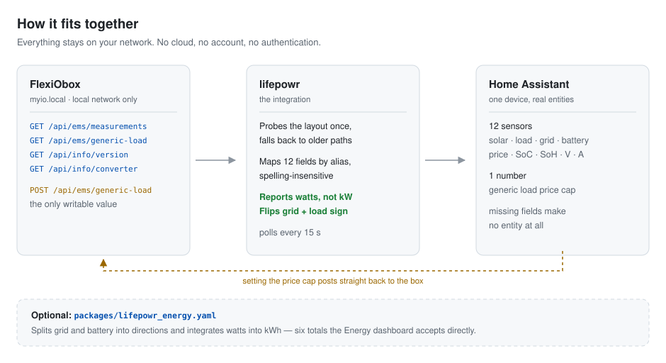
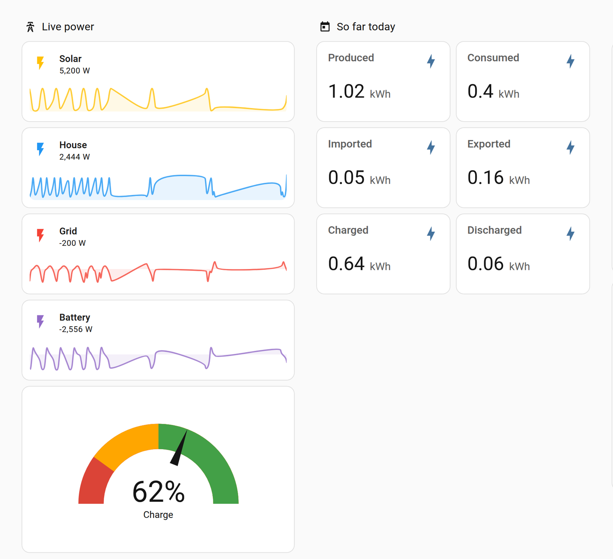

<h1 align="center">LIFEPOWR FlexiO for Home Assistant</h1>

<p align="center">
  Local-polling integration for the <a href="https://www.lifepowr.io">LIFEPOWR</a>
  <strong>FlexiObox</strong> home energy management system.<br>
  No account, no API key, no cloud between you and the box.<br>
  It also learns the shape of your roof from your own production history,
  and forecasts from it.
</p>

<p align="center">
  <a href="https://github.com/hacs/integration"></a>
  <a href="https://github.com/Robbe654321/lifepowr-flexio-ha/actions/workflows/validate.yml"></a>
  <a href="https://github.com/Robbe654321/lifepowr-flexio-ha/releases"></a>
  
  <a href="LICENSE"></a>
</p>

<p align="center">
  <picture>
    <source media="(prefers-color-scheme: dark)" srcset="docs/architecture-dark.svg">
    
  </picture>
</p>

---

## Why this exists

The FlexiObox has a perfectly good local API and no Home Assistant integration.
It also has documentation that disagrees with the box itself on six separate
points — including the unit of every power reading, which is off by a factor of
1000. This integration is written against the real hardware, and
[`docs/api-notes.md`](docs/api-notes.md) records every discrepancy so the next
person does not have to rediscover them.

## Supported devices

Any FlexiObox serving the *FlexiO Device API* on your local network. Verified
against **firmware 1.148.10** driving a **Goodwe GW12K-ET-20**. Its on-device
API documentation lives at `http://myio.local/api/docs`.

Older firmware exposing `/api/ems`, `/api/ems/load_control`, or one endpoint
per measurement is detected automatically and handled read-only.

## Installation

### HACS

1. HACS → three-dot menu → **Custom repositories**.
2. Add `https://github.com/Robbe654321/lifepowr-flexio-ha`, category
   **Integration**.
3. Install **LIFEPOWR FlexiO**, then restart Home Assistant.
4. **Settings → Devices & services → Add integration → LIFEPOWR FlexiO**.

### Manual

Copy `custom_components/lifepowr` into your `config/custom_components/`
directory and restart Home Assistant.

> Not in the HACS default store yet — [`docs/hacs.md`](docs/hacs.md) tracks
> what is left for that, and how to submit it.

## Configuration

One setting: the host. `myio.local` is the default and works on most networks.
If mDNS is not resolving — common with VLANs, guest networks, or some routers —
enter the box's IP address instead; your router's DHCP lease table has it. Both
a bare host and a full `http://…` URL are accepted.

If the box's address changes later, use **Reconfigure** on the integration
rather than deleting and re-adding it, so entity history survives.

### Poll interval

**Configure** on the integration sets how often the box is read: **10 seconds
by default, adjustable from 2 to 300**. The box is on your own network and
answers in milliseconds, so a few seconds costs nothing — the FlexiO app itself
refreshes at about that rate. Changing it reloads the integration; entity
history is kept.

Polling faster writes more states to your recorder database. If you want
second-level detail on a chart but not months of it, keep the interval low and
[exclude](https://www.home-assistant.io/integrations/recorder/#exclude) the
sensors you do not need long-term.

> Home Assistant's own history charts switch to 5-minute averages once you zoom
> out past a few hours — that is long-term statistics, not your poll interval.
> Recent history shows every reading.

## Entities

One device, with entities created only for the measurements your box actually
reports — nothing shows up permanently unknown.

| Entity | Unit | Notes |
| --- | --- | --- |
| Solar production | W | Total PV production |
| Household consumption | W | Positive while consuming |
| Grid power | W | Positive importing, negative exporting |
| Battery power | W | Positive discharging, negative charging |
| Inverter power (total AC) | W | Solar **and** battery together — see below |
| Battery state of charge | % | |
| Battery state of health | % | |
| Battery voltage | V | |
| Battery current | A | Negative while charging |
| Electricity price | €/kWh | Current consumption price |
| Generic load available power | W | Generic Load Controller |
| Inverter setpoint | W | Only on firmware reporting `powerSetpoint` |
| Last measurement | timestamp | Diagnostic, disabled by default |
| Converter | — | Diagnostic; the paired inverter |
| **Generic load maximum price** | €/kWh | **Writable** `number` |

Plus six cumulative totals for the [Energy dashboard](#energy-dashboard),
integrated from those power readings:

| Entity | Unit | Integrated from |
| --- | --- | --- |
| Solar production energy | kWh | Solar production |
| Household consumption energy | kWh | Household consumption |
| Grid import energy | kWh | Grid power, while positive |
| Grid export energy | kWh | Grid power, while negative |
| Battery charge energy | kWh | Battery power, while negative |
| Battery discharge energy | kWh | Battery power, while positive |

And, once the [solar forecast](#solar-forecast-that-learns-your-roof) is
switched on, six more:

| Entity | Unit | Notes |
| --- | --- | --- |
| Solar forecast now | W | Expected production this hour |
| Solar forecast today | kWh | Local calendar day |
| Solar forecast remaining today | kWh | From now until local midnight |
| Solar forecast tomorrow | kWh | |
| Solar forecast peak today | timestamp | When production should peak |
| Learned solar capacity | W | Diagnostic; the roof it worked out |

## Units and sign convention

Two things the vendor documentation gets wrong, both confirmed against real
hardware. If you only read one section, read this one.

**The API reports watts, not kilowatts.** The website's table says kW for every
power field. A box reporting `-5341.34` for grid power is drawing 5.3 kW — as
kilowatts that would be 5.3 megawatts.

**`TotalInvPowerFiltered` is not the battery.** It is the inverter's total AC
power, solar included. The battery's own flow is `inverter − PV`, which the
integration derives and exposes as **Battery power**. Use that one for energy
accounting; treating the inverter reading as the battery turns every sunny hour
into a phantom discharge.

**Consumption is negative.** The API uses a load convention: importing from the
grid, consuming in the house and charging the battery are all negative. Solar
production is positive. Home Assistant expects the opposite for grid and
consumption, so the integration negates those two. Battery flow keeps its raw
sign, where positive already means discharging.

<details>
<summary>The measurement that settles it</summary>

```
totalPVPowerFiltered       1160.6   TotalInvPowerFiltered     -2456.2
LoadPowerFiltered         -3002.1   MeterPowerFiltered        -5341.3
batteryVoltageInvFiltered   421.4   batteryCurrentInvFiltered    -8.31
```

Two independent identities, both closing within 3%:

| Identity | Computed | Reported | Gap |
| --- | --- | --- | --- |
| `grid ≈ load + inverter` | −5458 W | −5341 W | 2.2% — filter lag |
| `battery DC ≈ inverter − PV` | −3617 W | −3500 W | 3.3% — conversion loss |

That second identity is also the definition of the battery power sensor.

421.4 V × −8.31 A is 3.5 kW going into the battery, while the inverter pulls
2456 W from the grid plus 1161 W of solar. The 117 W difference is the
conversion loss, and it appears in both identities. That is only consistent in
watts, with this sign convention.

Home Assistant then shows: grid **5341 W importing**, consumption **3002 W**,
solar **1161 W**, battery **−2456 W charging**.

</details>

## Verify against your own box

`scripts/check_box.py` checks the field mapping on real hardware without
installing anything — standard library only, no Home Assistant, no pip:

```console
$ python3 scripts/check_box.py              # or: check_box.py 192.168.1.20
```

It reports which endpoints answer, which fields are recognised, warns about any
field it does not know yet, re-runs both energy balances against your live
readings, and checks that the timestamp resolves to roughly now. It writes
nothing unless you pass `--set-max-price 0.30`, which exercises the one write
endpoint.

**If it flags an unmapped field, please [open an issue][new-issue]** with the
name and value — that is exactly how this integration learns about firmware
variants.

## Energy dashboard

The Energy dashboard only lists sensors that report cumulative energy in kWh,
so the box's instantaneous watts cannot be selected there directly. The
integration therefore integrates them for you: on every poll each power
reading is added to a `total_increasing` kWh total, with the bidirectional grid
and battery flows split into two positive-only directions each so importing and
exporting never cancel out. The totals are restored across restarts, and gaps
longer than five minutes are skipped rather than guessed at.

No YAML, no template sensors, no restart — the six entities exist as soon as
the integration is set up. Map them in **Settings → Dashboards → Energy**:

| Energy dashboard slot | Entity |
| --- | --- |
| Grid consumption | `sensor.flexio_grid_import_energy` |
| Return to grid | `sensor.flexio_grid_export_energy` |
| Solar production | `sensor.flexio_solar_production_energy` |
| Battery: energy in | `sensor.flexio_battery_charge_energy` |
| Battery: energy out | `sensor.flexio_battery_discharge_energy` |

Set `sensor.flexio_electricity_price` as the grid consumption source's *"use an
entity with current price"* option for live cost tracking. Individual devices
can use `sensor.flexio_household_consumption_energy`.

Totals start at zero when the integration is installed: the API exposes live
values only, so there is no history to backfill. Expect the dashboard to stay
empty until the next hour rolls over, since long-term statistics are compiled
hourly.

> **Upgrading from `packages/lifepowr_energy.yaml`?** That package is gone —
> these sensors replace it. Delete the file from `config/packages/` and restart,
> then remove its leftover entities under **Settings → Devices & services →
> Entities** (they are shown as unavailable). Otherwise the built-in sensors
> claim `…_energy_2` entity IDs, because the old ones are still taken. Point
> the Energy dashboard at the new entities afterwards; their history starts
> fresh.

## Ready-made dashboard

The Energy dashboard answers "how much", by the hour and by the day. It does
not show you what the box is doing *this second*, and it has nothing to say
about state of charge, battery voltage, or the difference between the inverter
and the battery.

[`dashboards/energy.yaml`](dashboards/energy.yaml) is a complete four-view
dashboard that does. Dutch: [`dashboards/energy-nl.yaml`](dashboards/energy-nl.yaml).

<p align="center">
  
</p>

<sub>Part of the <strong>Now</strong> view. The readings come from a simulated
box used to test the dashboard, not from a real installation.</sub>

| View | Shows |
| --- | --- |
| **Now** | Live solar, house, grid and battery with 24-hour sparklines, state of charge, today's totals, and the last three hours as a graph |
| **Energy** | Home Assistant's own energy cards, plus every kWh total day by day |
| **Battery** | Charge, health, voltage, current, flow, and charge/discharge per day |
| **System** | Inverter versus battery, the writable price cap, and diagnostics |

Every card ships with Home Assistant — nothing else to install.

**To use it:** **Settings → Dashboards → Add dashboard → New dashboard from
scratch**. Open it, then **⋮ → Edit dashboard → ⋮ → Raw configuration editor**,
and replace everything there with the contents of the file.

Cards for a measurement your firmware does not report hide themselves rather
than showing an error. The sparklines inside the tiles need **Home Assistant
2025.10 or newer**; on older versions those tiles show a feature error and
everything else still works.

Both files are generated by `scripts/make_dashboard.py`, so the two languages
cannot drift apart; CI fails if the committed files differ from the generator.

## Endpoints used

| Endpoint | Purpose |
| --- | --- |
| `GET /api/ems/measurements` | Every live measurement |
| `GET /api/ems/generic-load` | Generic load state and price cap |
| `POST /api/ems/generic-load` | Sets the price cap — `{"newMaxPrice": …}` |
| `GET /api/info/version` | Firmware version, shown on the device page |
| `GET /api/info/converter` | Paired converter, exposed as a sensor |

That is the entire API. See [`docs/api-notes.md`](docs/api-notes.md) for how
this differs from the published documentation.

## Solar forecast that learns your roof

Every solar forecast wants three numbers per plane of panels: the tilt, the
compass bearing, and the peak power. Almost nobody knows them. The tilt is
guessed from the pitch of the ceiling, the bearing off a map, the wattage from
a label in the attic — and an installation that grew over time faces two or
three directions at once, each with its own angle. Whatever you type in, the
forecast inherits it.

Your measurements already know. Every orientation leaves a distinctive
fingerprint in the shape of a production curve: an east-facing plane peaks
before solar noon and fades early, a west-facing one does the opposite, a
steep plane earns its keep in December and loses in June. A roof with several
planes produces the *sum* of those fingerprints. So the question can be turned
around — which combination of orientations, weighted by capacity, reproduces
the history this installation has already recorded?

Switch it on under **Configure → Learn the roof and forecast production**. It
reads the hourly production statistics your recorder has been keeping, works
out the geometry overnight, and forecasts the coming days from the weather.
Nothing to enter.

### What it works out

- **How many planes of panels there are**, and the tilt, compass bearing and
  delivered capacity of each.
- **What is standing in front of them.** Trees and a neighbour's gable take
  the first and last hour of production away, and no tilt or azimuth can
  express that. The skyline is learned separately, one height per compass
  direction, because a fit denied one explains the missing evening by turning
  the panels east instead.
- **The inverter's ceiling**, so a forecast never predicts more than the
  hardware can deliver.

`sensor.flexio_learned_solar_capacity` is the diagnostic that shows the
working: its state is the total learned capacity and its attributes list every
plane, when the fit last ran, and how well it reproduces days that were held
out of it.

**Read the planes for what they are: the effective plane of each measured
source, not a survey of your roof.** One inverter often carries panels from
more than one roof plane, and the single plane that best explains such a
mixture comes out steeper and turned further from south than anything actually
up there. It forecasts that source well — measurably better than the true
angles do, because it absorbs the shading too — while describing no real
plane. So do not work panel counts out from how the capacity splits between
them: that assumes each plane is one orientation carrying its own honest share
of the losses, which a mixture is not.

The total is the solid number. On the installation this was developed against
it came out within a few percent of what PVGIS and the measured energy both
say, while the per-plane tilt was out by nearly twenty degrees on one plane.

> **A learned capacity reads lower than the number on your panels, and should.**
> It is *delivered AC power at 1000 W/m² on the panels themselves* — inverter
> efficiency, wiring, soiling, mismatch and any permanent shading are already
> inside it. On a real 14.3 kWp installation with trees around it, the fit
> lands near 9 kW. That gap is not an error in the fit; it is the difference
> between a label and a roof, and it is the reason a forecast built on the
> label runs high.

### Where the numbers come from

Irradiance comes from [Open-Meteo](https://open-meteo.com/), free and without
an API key — the measured past to learn from, the forecast future to predict
with. This is the one part of the integration that leaves your network: your
latitude and longitude go to Open-Meteo, nothing else.

Without it the fit falls back on its own cloudless-sky model and keeps only
the intervals that look cloudless. That works offline, and it is noticeably
worse: on the installation this was developed against, measured irradiance
lifted the score on held-out days from 0.69 to 0.82. The reason is that a
clear-sky model has to guess how a cloudless sky splits between hard direct
sunlight and the soft glow off the rest of the sky, and that split is exactly
what tilt is read from.

### Honest about what it cannot do

- **It can read someone else's history.** Under **Configure → Production
  history to learn from**, point it at any sensors with a longer record than
  the FlexiObox has — an older inverter integration, for instance. Either a
  power sensor or an energy counter will do, so a kWh meter from a previous
  setup counts. That is often the difference between forecasting today and
  forecasting next year. Pick **several** if you have them: two inverters read
  through two meters describe the same roof twice instead of once, and each is
  fitted its own planes before they are pooled.

  History outlives the hardware that made it: replace an inverter and its
  integration goes with it, taking the entity but leaving years of statistics
  in the database. Those are still readable, identified by their own recorded
  unit — but the entity picker can only offer entities that still exist, so
  it is worth learning the roof **before** removing the old integration.

  Pick meters that watch **different** panels, though. Listing two string
  inverters *and* the meter that replaced them counts the same roof twice.
  Where they overlap in time the fit spots that and leaves the combined one
  out; where they do not overlap it cannot tell, and says so in the log.
- **It needs history.** Roughly a year is what pins the tilt down, because
  tilt is read from how production changes with the seasons. It will fit with
  less and say so through a lower held-out score. A brand-new installation has
  nothing to learn from yet; it will start on its own once the recorder has
  enough.
- **Bearing is firmer than tilt, but only on a steep plane.** Bearing follows
  from the time of day production peaks. Tilt is entangled with how hazy the
  sky is assumed to be, and the two trade against each other. Worse, the two
  weaknesses compound: a shallow plane barely has a bearing to find, since at
  14° of tilt every bearing from east to west lands within 14% of due south,
  against 29% at 45°. A confident bearing on a plane the fit thinks is steep
  may be neither.
- **Several inverters are better than one.** The same roof read through two
  meters is a strictly richer measurement than their sum, and is fitted
  separately before the planes are pooled.
- **It will not find planes that are not there.** How many planes a roof gets
  is decided on days held out of the fit, so a second plane has to earn its
  place. Two orientations less than about 60° apart usually cannot be told
  apart from a single meter, and are reported as the one plane that fits.

### Seeing it as a curve

`Solar forecast now` is a single number, so its own history is a staircase and
tells you nothing about the shape of the day. There are two ways to see the
curve.

**The Energy dashboard**, which draws it behind your production bars — see
below. Nothing to build.

**Your own chart card**, from the hourly series published on
`sensor.flexio_solar_forecast_now` as the `forecast` attribute. Each entry is
the average watts over the hour beginning at its `datetime`. With
[apexcharts-card](https://github.com/RomRider/apexcharts-card):

```yaml
type: custom:apexcharts-card
graph_span: 2d
span:
  start: day
now:
  show: true
series:
  - entity: sensor.flexio_solar_forecast_now
    name: Forecast
    type: area
    stroke_width: 2
    data_generator: |
      return entity.attributes.forecast.map(p => [
        new Date(p.datetime).getTime(), p.power
      ]);
  - entity: sensor.flexio_solar_production
    name: Actual
    type: line
    group_by:
      func: avg
      duration: 1h
```

That plots the forecast against what the panels are really doing, which is the
comparison worth looking at.

> The series is a few hundred numbers rewritten every half hour. Keep it out of
> your database, or it will grow for no benefit:
>
> ```yaml
> recorder:
>   exclude:
>     entity_globs:
>       - sensor.flexio_solar_forecast_now
> ```
>
> Excluding the entity keeps the *state* out of history as well. To keep the
> state and drop only the attribute, leave the entity recorded and accept the
> cost, or chart from the Energy dashboard instead.

### On the Energy dashboard

Home Assistant draws a solar forecast as the expected-production line behind
your solar bars, which is the one place a forecast gets checked against
reality every day without anyone building a chart for it. This integration
supplies one — but Home Assistant's own picker will not offer it, so it has to
be set once by hand.

**Why it is not in the list.** The Energy dashboard's forecast picker asks for
config entries of `integration_type: service`. This integration is a
`device` — it is a box on your network — so the picker filters it out. The
back end has no such restriction: it accepts any integration that supplies a
forecast, and this one does. Only the chooser cannot show it.

The upshot is a dialog that lies to you in both directions. It will list only
the cloud forecast integrations you have, and if this one is already selected
it will show as though nothing is. Which leads to the trap:

> **Do not press Save in that dialog once this is set.** The frontend writes
> back whatever the tickboxes say, and they cannot represent this integration,
> so saving silently removes the forecast. If you do, set it again with the
> snippet below.

**Setting it.** Once, in the browser console (F12):

```js
const hass = document.querySelector("home-assistant").hass;

// Keep this line somewhere before going further.
const prefs = await hass.callWS({ type: "energy/get_prefs" });
console.log("BACKUP:", JSON.stringify(prefs));

const [entry] = await hass.callApi(
  "GET", "config/config_entries/entry?domain=lifepowr"
);
const energy_sources = prefs.energy_sources.map((source) =>
  source.type === "solar"
    ? { ...source, config_entry_solar_forecast: [entry.entry_id] }
    : source
);
await hass.callWS({ type: "energy/save_prefs", energy_sources });
```

Then reload the page. This replaces the forecast list outright, so any other
forecast integration comes off in the same move — which you want, since Home
Assistant draws every selected forecast together and two of them show you
roughly double.

**Checking it.** This returns the hours the dashboard is actually being given:

```js
await document.querySelector("home-assistant").hass.callWS({
  type: "energy/solar_forecast"
})
```

An object keyed by the config entry id, with `wh_hours` inside it, means the
chain is working end to end.

### Re-learning

The fit runs nightly by itself. After adding panels, call
`lifepowr.learn_solar_model` to redo it immediately rather than waiting.

## Data updates

Polled every 10 seconds by default, configurable from 2 to 300 seconds. The API
exposes filtered, instantaneous values only —
there is no history to backfill, so long-term statistics start the moment you
install the integration.

## Troubleshooting

<details>
<summary><strong>"Failed to connect"</strong></summary>

Ping the host from the machine running Home Assistant. If `myio.local` fails
but the IP address works, mDNS is not crossing your network — use the IP.

Home Assistant in Docker with a custom network, or on a different VLAN from the
box, will not resolve `.local` names at all.

</details>

<details>
<summary><strong>"That host responded, but it does not look like a FlexiObox"</strong></summary>

Something is answering on that address but serving no recognisable
measurements. Open `http://<host>/api/docs` in a browser to confirm you have
the right device, then run `scripts/check_box.py <host>` and
[open an issue][new-issue] with its output.

</details>

<details>
<summary><strong>Entities are missing</strong></summary>

Only measurements the box actually reports become entities. Download
diagnostics from the integration page to see exactly which fields were found
and which layout was detected.

</details>

<details>
<summary><strong>Power readings look wrong by a factor of 1000</strong></summary>

If your firmware genuinely reports kilowatts, `scripts/check_box.py` will say
so. Please [open an issue][new-issue] with its output and your firmware
version — the unit would then need to be detected rather than assumed.

</details>

## Known limitations

- **Local network only.** The API is unreachable from outside your home
  network, and this integration does not work around that. Put Home Assistant
  on the same network, or the same VPN subnet as the box.
- **No authentication.** The API is unauthenticated by design — anyone on your
  LAN can read it, and write the price cap. Segment your network accordingly.
- **One writable value.** Only the generic load's price cap can be set. The
  inverter itself cannot be commanded through this API. On firmware without
  `/api/ems/measurements` the `number` entity is not created at all, because
  the write endpoint does not exist there either.
- **No history, no per-phase or per-string detail.** The learned solar
  forecast works around the missing history by reading Home Assistant's own
  recorder statistics, but the box itself still offers none.

## Removal

Delete the integration from **Settings → Devices & services**. Its energy
totals go with it; the Energy dashboard keeps the statistics already recorded
until you remove those sources from its configuration.

## Contributing

Field mappings from other firmware versions are especially welcome — see
[CONTRIBUTING.md](CONTRIBUTING.md). The integration is written to Home
Assistant core standards; `custom_components/lifepowr/quality_scale.yaml`
tracks what is still missing for a core submission.

## Disclaimer

Not affiliated with, endorsed by, or supported by LIFEPOWR. LIFEPOWR and
FlexiO are their trademarks; this project just talks to the box.

[new-issue]: https://github.com/Robbe654321/lifepowr-flexio-ha/issues/new/choose
